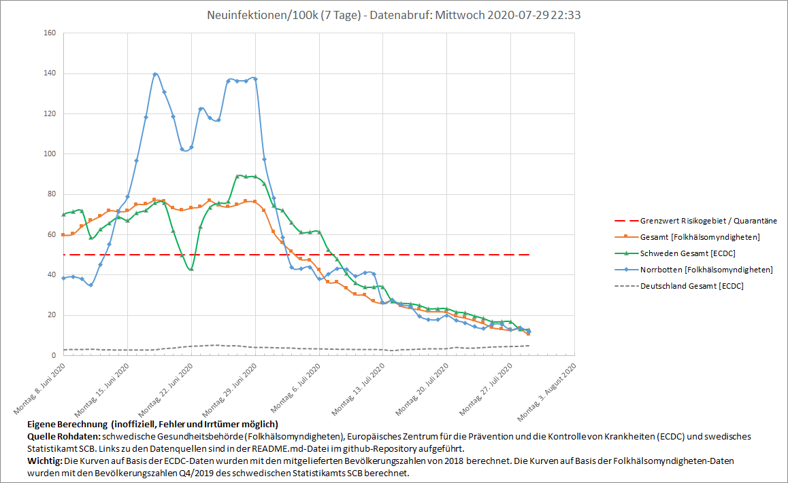

# Visualization of new covid-19 cases in sweden within last 7 days
The `update-xlsx.ps1` script collects covid-19 data from the swedish `Folkhälsomyndigheten` agency (swedish public health department) as well as the `European Centre for Disease Prevention and Control` (`ECDC`) and updates the `swe-corona.xlsx` file accordingly. Excel is used for easy visualization of the data.

Intent: A quarantine is currently required when returning from sweden to germany if there have been more than 50 new infections per 100k inhabitants within the last seven days. Neither `Folkhälsomyndigheten` nor RKI provide a prebuilt plot of this metric. Keep in mind: not the swedish goverment's values nor the inofficial calculations used by this repository are relevant, but the data gathered by RKI! Therefore, the data visualized by `swe-corona.xlsx` can only be an indicator! **Ultimately relevant are the [values published by german RKI](https://www.rki.de/DE/Content/InfAZ/N/Neuartiges_Coronavirus/Quarantaene_Einreisen_Deutschland.html).**

**Please note, that `Folkhälsomyndigheten` updates historic data that has previously been published. Therefore, these values are likely to increase within the days after initial publication.**

## Data sources
## Folkhälsomyndigheten
 - Covid-19 case data for sweden: [Retrieved from `Folkhälsomyndigheten`](https://www.folkhalsomyndigheten.se/smittskydd-beredskap/utbrott/aktuella-utbrott/covid-19/bekraftade-fall-i-sverige/) - please note, that published values are continuously updated by `Folkhälsomyndigheten` when new data is available and are subject to continuous changes (rise)!
 - Swedish population Q4/2019: [Retrieved from sweden's statistics agency SCB](https://www.scb.se/en/finding-statistics/statistics-by-subject-area/population/population-composition/population-statistics/pong/tables-and-graphs/quarterly-population-statistics--municipalities-counties-and-the-whole-country/quarter-4-2019/)
## European Centre for Disease Prevention and Control (ECDC)
 - Covid-19 cases are extracted from [ecdc's csv downloadable data set](https://www.ecdc.europa.eu/en/publications-data/download-todays-data-geographic-distribution-covid-19-cases-worldwide)
 - Swedish population 2018 contained in above csv data set is used for calculation

## Requirements
 - Powershell v5
 - Excel 2016 (other versions are likely to work as well)
 
## How To
 1. Make sure `swe-corona.xlsx` is not opened
 2. Run powershell script `update-xlsx.ps1`
 3. Open `swe-corona.xlsx` to view the collected data
 
## Git Setup
Before commiting to this repository, [_setup.sh](_setup.sh) should be run to
setup a [git smudge filter](https://www.git-scm.com/docs/gitattributes#_filter),
that decompresses `xlsx` files during commit: `xlsx` files are zip compressed
archives of mostly `xml` formatted plaintext files. Git's delta compression
works very well for xml files, but not if compressed. For security reasons, the
filter needs to be configured explicitly. Therefore, it cannot be shared in a
way that does need user interaction. Decompressing is done using compression
level `store` which preserves full FreeCAD compatibility. A clean filter is not
used, therefore files in working tree are slightly bigger after checkout
compared with the initial file size.
